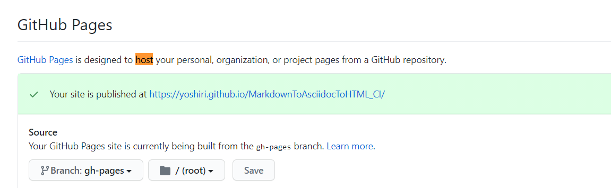

# GitHub Actions Trial

Use GitHub Actions to convert **markdown to html via asciidoc**

- Actions Flow
  - markdown -> asciidoc : Pandoc
  - asciidoc -> html : asciidoctor
  - html hosting : gh-pages

## How to use

1. clone(fork) this repository
2. create your own repository and set it to remote with `git remote set-url origin https://github.com/USERNAME/REPOSITORY.git`
3. modify your sample.md and push
4. check your `gh-pages` branch to confirm `sample.html` is in the folder
5. Go to `Setting -> Option` and setting the GitHub Pages  (like figure below)
6. Congrats! You can see your html file at `https://<your_name>.github.io/<your_repository_name>/sample.html`.

In this sample, the output html can be accessed from [`https://yoshiri.github.io/MarkdownToAsciidocToHTML_CI/sample.html`](https://yoshiri.github.io/MarkdownToAsciidocToHTML_CI/sample.html) .

